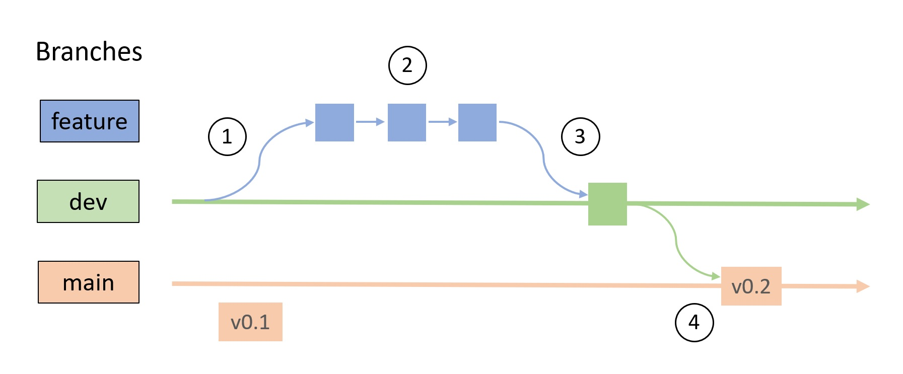

# CaImAn contributors guide
CaImAn is an open source project where *everyone* is welcome and encouraged to contribute. We have external contributors from all over the world, and we are always looking for more help. The guide below explains how to contribute to Caiman: if you have questions about the process, please feel free to reach out at [Gitter](https://app.gitter.im/#/room/#agiovann_Constrained_NMF:gitter.im). Everyone typically needs some help at first, so please don't be shy about asking. 

There are many different ways you can contribute to Caiman. The first and easiest way is to bring problems to our attention: if you find a bug, or think there is a feature that is lacking in Caiman, please [open an issue at Github](https://github.com/flatironinstitute/CaImAn/issues). You can also contribute simply by *participating* in the different forums.   

Second, let's say you want to improve something yourself:

- Documentation like what you are currently reading
- The demo notebooks
- The code base

We welcome all such contributions! To do this you need to make changes on your local version of Caiman then push this to the repository by making a **Pull Request** (PR). We will walk you through this process in the rest of the document. 

Before you go through the work required to improve something, we recommend that you let us know your plans. E.g., open an issue, or reach out on Gitter. This way, we can avoid duplicated effort (if someone is already working on it), or wasted time (it could turn out the changes might not be feasible right now). We can usually set up a video chat on Google or Skype to talk about a feature proposal if that works for you.

## Background: how does this work?
In this section we'll give general background on how making a contribution/PR works. If you just want to get started quickly, feel free to skip to the next section.

There are many possible workflows for contributing to open source projects (see a summary [here](https://docs.gitlab.com/ee/topics/gitlab_flow.html)). The basic structure of the workflow we use at Caiman is illustrated here:

When you are working on a git repository, you are always working on a *branch*, and each branch has a name. Some branches are special, `main`, which contains the stable version of the software for general release. Different feature branches, which will have names like `fix_plotting_bug` are usually short-lived and what individual contributors like you will work on. 

To keep a buffer between the main branch and individiaul feature branches, there is a second persistent branch, a development branch called `dev`. This the branch that contributors actively push their changes to, and is the one with all the newest developments.

The workflow for contributing to Caiman is roughly illustrated by the numbers in the above diagram:
1) Create a feature branch from `dev`.
2) Work on that feature until you are ready to push it to Caiman.
3) Make a PR: this is when you request that your changes become merged into `dev` at Caiman. This merge won't be immediate, you will get feedback on your code, and probably be asked to make some changes. 
4) Eventually, once enough new features accumulate in the `dev` branch to merit a new release (every month or so), the `dev` branch will be merged with `main`. This will become a new version of Caiman that people download when they run `mamba install caiman`. 

Below we have instructions on how to do all of the above steps. While all of this may seem like a lot, some of the steps are extremely simple. Also, once you have done it once, you will have the recipe and it will be pretty easy. Finally, it is a very rewarding experience to contribute to an open source project -- we hope you'll take the plunge!

## First, create a dedicated development environment
If you have downloaded Caiman for standard use, you probably installed it using `conda` or `mamba` as described on the README page. As a contributor, you will want to set up a dedicated development environment. This means you will be setting up a version of Caiman you will edit and tweak, uncoupled from your main installation for everyday use. To set up a development environment so you can follow the worflow outlined above, do the following:

1. Fork and clone the caiman repository    
Go to the [https://github.com/flatironinstitute/CaImAn](Caiman repo) and hit the `Fork` button at the top right of the page. You now have Caiman on your own GitHub repo. On your computer, in your conda prompt, go to a directory where you want Caiman to download, and clone your personal Caiman repo: `git clone https://github.com/<your-username>/CaImAn.git` where <your-username> is replaced by your github username.
2. Install in editable mode   
In the previous step, you cloned your personal fork of Caiman. Detailed instructions for installing in development mode can be found on our [installation page](./docs/source/Installation.rst) for both Windows and Mac/Linux. While there are some differences, they both involve creating a conda environment from the `environment.yml` file you downloaded when you cloned the repo, activating that environment, and end with an "in place" install:

        pip install -e . 

    This installs Caiman directly from source code, leaving all the files you downloaded intact, and the `-e` stands for editable. When you edit the files, the changes will appear in your virtual environment.

Note this section is partly based on the excellent [docs from Matplotlib](https://matplotlib.org/devdocs/devel/development_setup.html#installing-for-devs).

## Second, work on a feature 
Once you have a development environment, you can start working on the changes you envision. The main thing to remember is to follow the workflow in the diagram above. Let's say you want to work on feature `my_feature`. The first thing to do (label 1 in the diagram) is to create a new branch from the `dev` branch. Within the repo folder:

    git checkout -b my_feature dev

Then from within this branch you can do your usual work on the feature: work on stuff, add, commits, etc. This corresponds to the workflow in the blue boxes in the above diagram (label 2 in the figure).

If you changed anything in the `.py` modules, we request that you run tests on your code before making a PR. You can test the code by typing `caimanmanager.py test`. 

## Third, make a PR
Once your feature branch is ready, it's time to make a PR (label 3 in the figure). This is fairly simple:

    git push -u origin my_feature

Then, go to your local fork of Caiman at your github repo, and a large green button will show at the top, giving you the option of making a `Pull request`. When you click it, this will send over your feature for review (be sure to push to merge with dev branch, not main, and to fill out the PR template that is auto-generated by Caiman with the information requested). 

Note that all PRs are reviewed by other programmers. This is an important part of the process: they will almost always give comments, making suggestions or asking questions about changes using Github's pull request interface. 

You may be asked to make some changes (or to think about making some changes). You will sometimes need to do more some more work on your branch and make more changes after making an initial PR. In this case, the workflow is simple: you will work within your your local `my_feature` branch as before, and run the `push` command again. Conveniently, this will automatically push the changes to the same work-in-progress PR at Caiman. Note that if your PR is open for too long, merge conflicts can start to emerge as the `dev` branch changes.

## Fourth, wait for the work to show up in main
Once your work is done, it will eventually be integrated into `main`  by the developers who maintain Caiman (label 4 in the figure). This is done every month or two, and is the stage when your work will actually be visible to people who download Caiman. It's at this point your name will appear when you click on the [list Contributors](https://github.com/flatironinstitute/CaImAn/graphs/contributors) at Github -- time to give yourself a big pat on the back! We really appreciate the folks who go through all the work to help make the package better.

# What next?
Once you have gone through the above steps, you can delete your local feature branch. Before working on a new feature, you will want to make sure that your fork stays up to date with Caiman. You can do this easily with the user interface at GitHub (there is a button to sync up your repo with the original repository on a particular branch). 

Nobody remembers all the git commands, don't worry if you constantly are looking things up: that's what we all do. If you want to learn more, check out the following resources:

* [Getting started with git/github](https://github.com/EricThomson/git_learn)
* [GitHub on Contributing to a Project](https://git-scm.com/book/en/v2/GitHub-Contributing-to-a-Project)
* [GitHub skillbuilding](https://skills.github.com/)
* [Scipy git resources](https://docs.scipy.org/doc/scipy/dev/gitwash/gitwash.html#using-git)

Again, if you want to contribute and find any of the above bits confusing, please reach out at [Gitter](https://app.gitter.im/#/room/#agiovann_Constrained_NMF:gitter.im). We are here to help.

