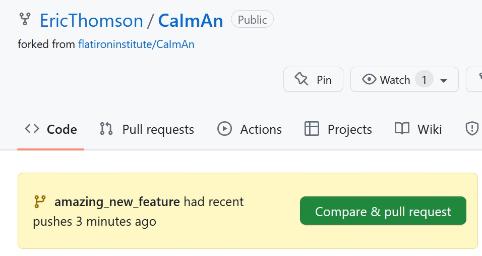

# CaImAn guide to contributing
CaImAn is an open source project with contributors from many people at many places. Help is available on [Gitter](https://app.gitter.im/#/room/#agiovann_Constrained_NMF:gitter.im) or [Github Discussions](https://github.com/flatironinstitute/CaImAn/discussions).

If you run into issues or want to suggest features, you can [open an issue on Github](https://github.com/flatironinstitute/CaImAn/issues).

Second, let's say you want to improve something yourself:

- Documentation like what you are currently reading
- The demo notebooks
- The code base

To contribute, start by making changes on your local version of Caiman and then push make a *Pull Request* (PR) to our GitHub repository. We will walk through this process in the rest of the document. 

Before you go through the work required to improve something, we recommend that you reach out on GitHub by filing a feature request in an issue. This way, we can avoid duplicated effort (if someone is already working on it), or wasted time (we may not agree on direction).

## Background: how do pull requests work?
In this section we'll give general background on how making a contribution/PR works. If you know this stuff and just want to get started quickly, feel free to skip to the next section.

There are [many possible workflows](https://www.atlassian.com/continuous-delivery/continuous-integration/trunk-based-development) for contributing to open source projects. The basic structure of the workflow used at Caiman is illustrated here:

When you are working on a git repository, you are always working on a *branch*, and each branch has a name. Some branches are special and persist for a long time,  like `main`, which contains the stable version of the software for general release. The different feature branches, which will have names like `fix_plotting_bug`, are relatively short-lived and are where contributors work on fixing bugs or developing features. To keep a buffer between the main branch and individual feature branches, there is a second special persistent branch, a development branch called `dev`. This the branch that contributors actively push their changes to, and is the one with all the newest developments.

The workflow for contributing to Caiman is roughly illustrated by the numbers in the above diagram:
1) Create a feature branch from `dev`.
2) Work on that feature until you are ready to push it to Caiman.
3) Make a PR: this is when you request that your changes become merged into `dev` at Caiman. This merge won't be immediate, you will get feedback on your code, and probably be asked to make some changes. 
4) Periodically, as features accumulate in the `dev` branch (every month or so), the `dev` branch will be merged with `main`. This will become a new version of Caiman that people install when they run `mamba install caiman`. 

Below we have instructions on how to do all of the above steps. 

## First, create a dedicated development environment
If you have downloaded Caiman for standard use, you probably installed it using `conda` or `mamba` as described on the README page. As a contributor, you will want to set up a dedicated development environment. This means you will be setting up a version of Caiman you will edit and tweak, uncoupled from your main installation for everyday use. To set up a development environment so you can follow the workflow outlined above, do the following:

1. Fork Caiman  
Go to the [Caiman repo](https://github.com/flatironinstitute/CaImAn) and hit the `Fork` button at the top right of the page. You now have Caiman on your own GitHub page! 

2. Clone Caiman     
   On your computer, in your conda prompt (or whatever command line interface you use for git), go to a directory where you want the Caiman repo/folder downloaded, and enter:    
   
   `git clone https://github.com/<your-username>/CaImAn.git` 
   
   where `<your-username>` is replaced by your GitHub username. You now have a local version of the repo! 
   
3. Add a remote upstream version        
    Switch into the Caiman folder `cd CaImAn` and add the canonical Flatiron Caiman repo as your upstream branch:    

    `git remote add upstream https://github.com/flatironinstitute/CaImAn`. 

    You now have a local version of Caiman that is connected to two remote versions at GitHub: your personal fork (named `origin`), and the original at Flatiron (named `upstream`).  You can verify this with the command `git remote -v`. This makes it easier to keep your local branches up to date with `git pull upstream`.

4. Install in development mode   
    Detailed instructions for installing in development mode (for purposes of writing code and making new features) can be found on our [installation page](./docs/source/Installation.rst). While there are some OS-specific differences, they all involve creating a conda environment from the `environment.yml` file you downloaded when you cloned the repo, activating that environment, and installing Caiman with:

        pip install -e . 

    This installs Caiman directly from the downloaded source code. The `-e` stands for 'editable': when you edit the files, the changes should immediately be reflected in the code you run.

Note this section is partly based on the [docs from Matplotlib](https://matplotlib.org/devdocs/devel/development_setup.html#installing-for-devs).

## Second, work on a feature 
Once you have a development environment, you can start working on the changes you envision. The main thing to remember is to follow the workflow in the diagram above. Let's say you want to work on feature `my_feature`. The first thing to do (label 1 in the diagram) is to create a new branch from the `dev` branch. Within the repo folder:

    git checkout dev # checkout dev branch        
    git checkout -b my_feature  # create new branch off of dev

Then from within this new branch you can do your work on the feature: code, add, commit, etc. This corresponds to the workflow in the blue boxes in the above diagram (label 2 in the figure).

If you changed anything in the `.py` modules, we request that you run tests on your code before making a PR. You can test the code by typing `caimanmanager test`. But obviously you will probably want to test to make sure you code works in different uses cases, your plots all are reasonable, and save this code and share it with us so we can test it too! This is all useful information for the developers.

## Third, make a PR
Once your feature branch is ready, it's time to make a PR (label 3 in the figure). This is fairly simple:

    git push origin my_feature

This pushes `my_feature` to your fork of Caiman (which, recall, is named `origin`). Then, go to your fork of Caiman at your personal GitHub repo, and a large green button will show at the top that gives you the option of making a pull request. Here is an example from a feature branch called `amazing_new_feature`: 

When you click the `Compare & pull request` button, it will bring up an interface to integrate your code at the main Caiman repo. Be sure to generate your PR targeting the `dev` branch, not `main`, and fill out the PR template that is auto-generated by Caiman with the information requested. 

Note that all PRs are reviewed by other programmers. This is an important part of the process: they will almost always give comments, making suggestions or asking questions about changes using Github's pull request interface. 

You may be asked to make some changes (or to *think* about making some changes). You will sometimes need to do more some more work on your branch and make more changes after making an initial PR. In this case, the workflow is simple: you will work within your your local `my_feature` branch as before, and run the `push` command again. Conveniently, this will automatically push the changes to the same work-in-progress PR at Caiman. Eventually, the feature will be merged into `dev` and your work is done!

## Fourth, wait for the work to show up in main :clock8: 
Once your work is done, the `dev` branch will eventually be merged into `main`  by the developers who maintain Caiman (label 4 in the figure). This is done every month or two, and is the stage when your work will actually be available to the people who download Caiman. It's at this point your name will appear when you click on the [list of Contributors](https://github.com/flatironinstitute/CaImAn/graphs/contributors) at GitHub. 

# What next?
Once you have gone through the above steps, you can delete your local feature branch. Before working on a new feature, you will want to make sure that your fork stays up to date with Caiman. You can do this with the user interface at GitHub (there is a button to sync up your repo with the original repository on a particular branch). 

If you want to learn more, check out the following resources:

* [Getting started with git/github](https://github.com/EricThomson/git_learn)
* [GitHub on Contributing to a Project](https://git-scm.com/book/en/v2/GitHub-Contributing-to-a-Project)
* [GitHub skillbuilding](https://skills.github.com/)
* [Scipy git resources](https://docs.scipy.org/doc/scipy/dev/gitwash/gitwash.html#using-git)

