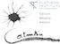

# CaImAn 


A Python toolbox for large-scale **Ca**lcium **Im**aging **An**alysis.    

CaImAn implements a set of essential methods required to analyze calcium and voltage imaging data. It provides fast and scalable algorithms for motion correction, source extraction, spike deconvolution, and registering neurons across multiple days. It is suitable for both two-photon and one-photon fluorescence microscopy data, and can be run in both offline and online modes. Documentation is [here](https://caiman.readthedocs.io/en/latest/). 

# Quick start :rocket:
To get started quickly, from installation to working through a demo notebook, take the following three steps. If you do not already have the conda package manager installed, [you can find it here](https://docs.conda.io/en/latest/miniconda.html).

### Step 1: Install caiman
The following is all done in your anaconda prompt, starting in your base environment:
  
    conda install -n base -c conda-forge mamba   # install mamba in base environment
    mamba create -n caiman -c conda-forge caiman # install caiman
    conda activate caiman  # activate virtual environment

### Step 2: Download code samples and data sets
Create a working directory with code samples and related data in a folder called `caiman_data`. While still in the caiman virtual environment created in the previous step:  

    caimanmanager.py install

### Step 3: Try out a demo notebook
Step 2 created a `caiman_data` folder in your home directory. Here, we `cd` to the demo notebooks folder, and open a Jupyter notebook:

    cd <your home>/caiman_data/demos/notebooks  
    jupyter notebook 

Jupyter will open. Click on `demo_pipeline.ipynb` to get started with a demo! 

> Note that what counts as `<your home>` in the first command depends on your OS/computer. Be sure to fill in your actual home directory. On Linux/Mac it is `~` while on Windows it will be something like `C:\Users\your_user_name\` 

## For installation help
Caiman should install easily on Linux, Mac, and Windows. If you run into problems, we have a dedicated [installation page](./docs/source/Installation.rst): the details there should help you troubleshoot. If you don't find what you need there, *please* send us a [message on Gitter](https://app.gitter.im/#/room/#agiovann_Constrained_NMF:gitter.im), and we will help you get it sorted out. 

# Demo notebooks :page_with_curl:
Once you've gotten things set up, the best way to get started learning Caiman is to select the demo notebook that most closely matches your use case, and adapt it for your particular needs.

In the demo notebooks folder within `caiman_data`, Caiman provides demo notebooks that demonstrate each of our main pipelines, from motion correction to online CNMF. The notebooks demonstrating the core algorithms, CNMF and CNMFE, are the best place to start: they have the most details that are used in the rest of the notebooks. 

The main use cases and notebooks are in the following table:

| Use case | Demo notebook | Paper |
|:-------- |:------------- | --------------------- |
| CNMF for 2p or low-noise 1p data | [demo_pipeline.ipynb](./demos/notebooks/demo_pipeline.ipynb) |  [Pnevmatikakis et al., 2016](https://pubmed.ncbi.nlm.nih.gov/26774160/) | 
| CNMFE for 1p data  | [demo_pipeline_cnmfE.ipynb](./demos/notebooks/demo_pipeline_cnmfE.ipynb) |  [Zhou et al., 2018](https://pubmed.ncbi.nlm.nih.gov/29469809/) | 
| Volpy for voltage data | [demo_pipeline_voltage_imaging.ipynb](./demos/notebooks/demo_pipeline_voltage_imaging.ipynb) |  [Cai et al., 2021](https://pubmed.ncbi.nlm.nih.gov/33852574/) | 
| Volumetric (3D) CNMF | [demo_caiman_cnmf_3D.ipynb](./demos/notebooks/demo_caiman_cnmf_3D.ipynb) | [Mentioned in Giovannucci et al., 2019](https://pubmed.ncbi.nlm.nih.gov/30652683/) | 
| CNMF for dendrites | [demo_dendritic.ipynb](./demos/notebooks/demo_dendritic.ipynb) | Developed by Eftychios Pnevmatikakis | 
| Online CNMF (OnACID) | [demo_OnACID_mesoscope.ipynb](./demos/notebooks/demo_OnACID_mesoscope.ipynb) |[Giovannucci et al., 2017](https://proceedings.neurips.cc/paper_files/paper/2017/hash/4edaa105d5f53590338791951e38c3ad-Abstract.html) | 
| Online volumetric CNMF | [demo_online_3D.ipynb](./demos/notebooks/demo_online_3D.ipynb) | Developed by Johannes Friedrich | 
| Online CNMFE (OnACID-E) | [demo_realtime_cnmfE.ipynb](./demos/notebooks/demo_realtime_cnmfE.ipynb) |[Friedrich et al. 2020](https://pubmed.ncbi.nlm.nih.gov/33507937/) | 
| Motion correction | [demo_motion_correction.ipynb](./demos/notebooks/demo_motion_correction.ipynb) | [Pnevmatikakis et al., 2017](https://pubmed.ncbi.nlm.nih.gov/28782629/) | 
| Register cells across sessions | [demo_multisession_registration.ipynb](./demos/notebooks/demo_multisession_registration.ipynb) | [Pnevmatikakis et al., 2016](https://pubmed.ncbi.nlm.nih.gov/26774160/) | 

A comprehensive list of references, where you can find detailed discussion of the methods and their development, can be found [here](https://caiman.readthedocs.io/en/master/CaImAn_features_and_references.html#references). 


# Questions, help, and next steps 
In addition to the demos, there are many ways to learn more about Caiman and receive help:
- [The online documentation](https://caiman.readthedocs.io/en/latest/) contains a lot of general information about Caiman, the parameters, how to interpret its outputs, and more. 
- The [Gitter forum](https://app.gitter.im/#/room/#agiovann_Constrained_NMF:gitter.im) is a great place to ask questions.
- If you have found a bug, we recommend searching the [issues at github](https://github.com/flatironinstitute/CaImAn/issues) and opening a new issue if you can't find the solution there. 
- If there is a feature you would like to see implemented, feel free to come chat at Gitter or open an issue at Github.

In generaly, you don't have to need help to get involved. We love when users talk about use cases answer other people's questions, etc at Gitter and Github. 

# How to contribute :hammer:
 Caiman is an open-source project and improves because of contributions from users all over the world. If there is something about Caiman that you would like to improve, then you are qualified to contribute. We are always looking for more contributors, so please come read the [contributors page](./CONTRIBUTING.md) for more details about how. 

# Videos 
There are multiple online videos by Andrea Giovannucci from past Caiman workshops/events that are an excellent start for newcomers.

The following talk provides a good high-level introduction to Caiman:    
https://www.youtube.com/watch?v=5APzPRbzUIA

The following talks are more in depth:

* https://www.youtube.com/watch?v=KjHrjhvhRy0
* https://www.youtube.com/watch?v=rUwIqU6gVvw
* https://www.youtube.com/watch?v=NZZ6_zo0YIM
* https://www.youtube.com/watch?v=z6TlH28MLRo


# Related repositories :pushpin:
There are many repositories that make heavy use of Caiman, or will help make using Caiman easier. If you would like your software to be in this list, please contact one of the developers or open an issue:

* [use\_cases repo](https://github.com/flatironinstitute/caiman_use_cases):  additional code (unmaintained) demonstrating how to reproduce results in some Caiman-related papers, and how to use/extend Caiman.
* [jnormcorre](https://github.com/apasarkar/jnormcorre): [JAX](https://github.com/google/jax) implementation of NoRMCorre for motion correction using JAX acceleration
* [funimag](https://github.com/paninski-lab/funimag): matrix decomposition for denoising and compression
* [mesmerize-core](https://github.com/nel-lab/mesmerize-core): parameter optimization, data organization and visualizations with Caiman
* [improv](https://github.com/project-improv/improv):  a platform for creating online analysis workflows that lets you use Caiman in real time (e.g., for all-optical experiments)

If you have questions about these related packages please reach out to their maintainers directly. 

# Citing Caimian and related papers
If you publish a paper that relied on Caiman, we kindly ask that you [cite Giovannucci et al., 2019](https://elifesciences.org/articles/38173):
```
@article{giovannucci2019caiman,
  title={CaImAn: An open source tool for scalable Calcium Imaging data Analysis},
  author={Giovannucci, Andrea and Friedrich, Johannes and Gunn, Pat and Kalfon, Jeremie and Brown, Brandon L and Koay, Sue Ann and Taxidis, Jiannis and Najafi, Farzaneh and Gauthier, Jeffrey L and Zhou, Pengcheng and Khakh, Baljit S and Tank, David W and Chklovskii, Dmitri B and Pnevmatikakis, Eftychios A},
  journal={eLife},
  volume={8},
  pages={e38173},
  year={2019},
  publisher={eLife Sciences Publications Limited}
}
```
If possible, we'd also ask that you cite the papers where the original algorithms you use (such as CNMF) were developed. A list of such references can be found [here](https://caiman.readthedocs.io/en/master/CaImAn_features_and_references.html#references). 


# Main developers
* (emeritus) Eftychios A. Pnevmatikakis, **Flatiron Institute, Simons Foundation** 
* (emeritus) Andrea Giovannucci, **University of North Carolina, Chapel Hill**
* Johannes Friedrich, **Allen Institute,Seattle Washington**
* Changlia Cai, **University of North Carolina, Chapel Hill**
* Pat Gunn, **Flatiron Institute, Simons Foundation**
* Eric Thomson, **Flatiron Institute, Simons Foundation**

A complete list of contributors can be found [here](https://github.com/flatironinstitute/Caiman/graphs/contributors). Currently Pat Gunn, Johannes Friedrich, and Eric Thomson are the most active contributors.


# Acknowledgements 
Special thanks to the following people for letting us use their datasets in demo files:

* Weijian Yang, Darcy Peterka, Rafael Yuste, Columbia University
* Sue Ann Koay, David Tank, Princeton University
* Manolis Froudarakis, Jake Reimers, Andreas Tolias, Baylor College of Medicine
* Clay Lacefield, Randy Bruno, Columbia University
* Daniel Aharoni, Peyman Golshani, UCLA

# License
This program is free software; you can redistribute it and/or
modify it under the terms of the GNU General Public License
as published by the Free Software Foundation; either version 2
of the License, or (at your option) any later version.

This program is distributed in the hope that it will be useful,
but WITHOUT ANY WARRANTY; without even the implied warranty of
MERCHANTABILITY or FITNESS FOR A PARTICULAR PURPOSE.  See the
GNU General Public License for more details.

You should have received a copy of the GNU General Public License
along with this program.  If not, see <http://www.gnu.org/licenses/>.
