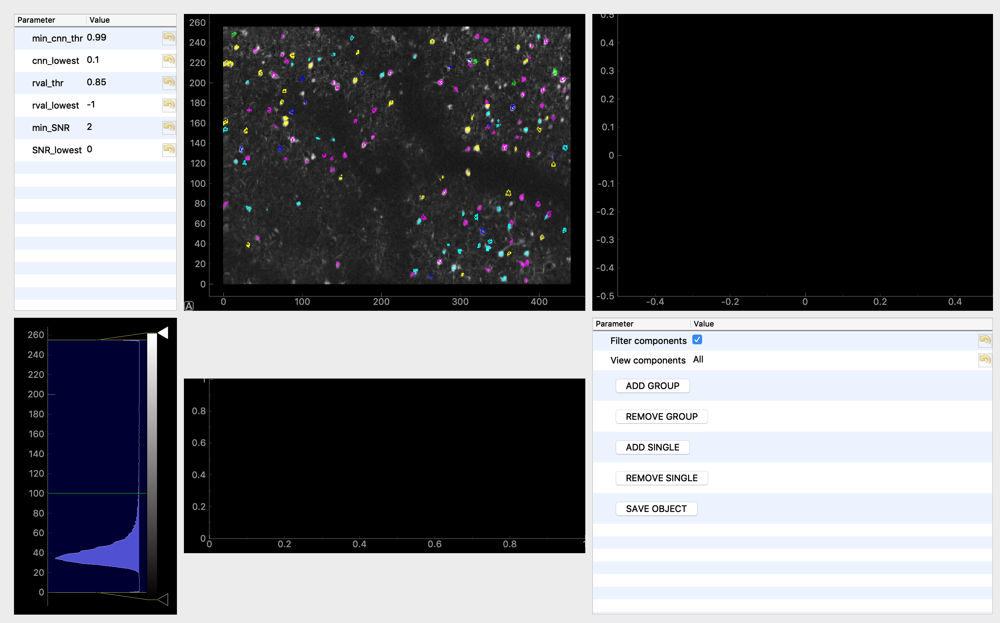

Graphical interfaces
====================

The CaImAn GUI
---------------

CaImAn comes with an experimental visual interface. To see an example on
how use it, first load and run either \* demo_OnACID_mesoscope.py \*
demo_caiman_basic.py \* demo_pipeline.py

Each of these demos will save a results file. You can then start the
visual interface by visiting the caiman_data folder, under the bin folder,
and issuing the following command:

::

   python caiman_gui.py

You will then be asked to load the file that is generated at the end of
each file (ending in .hdf5) The associated .mmap files also need to be
present in the same directory as the .hdf5

A visual interface will appear, where you will be able to: 
* regulate gain and contrast for the background image (correlation image)
* regulate the threshold over the spatial masks to visualize components contours
* click on neurons and see the corresponding trace and mask
* select subset of neurons based on different quality metrics
* save the resulting selection to a file in hdf5 format

More features will be added in the future.

External interfaces
-------------------

A couple of very nice GUIs that directly call CaImAn have been developed recently
by external researchers. For more information please check the following projects:

  - `MESmerize <http://www.mesmerizelab.org/>`_ (Python)
